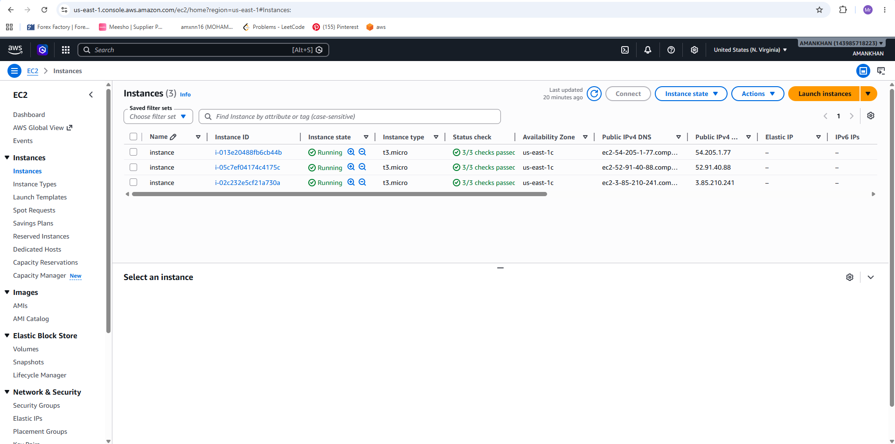
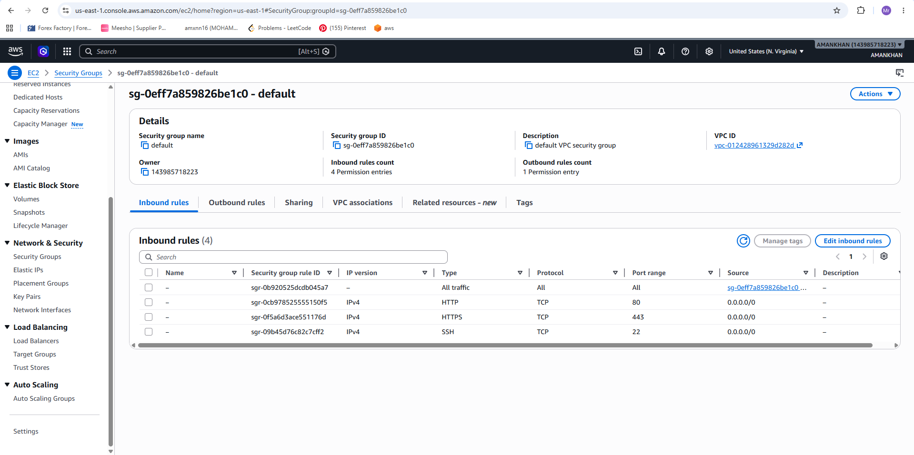
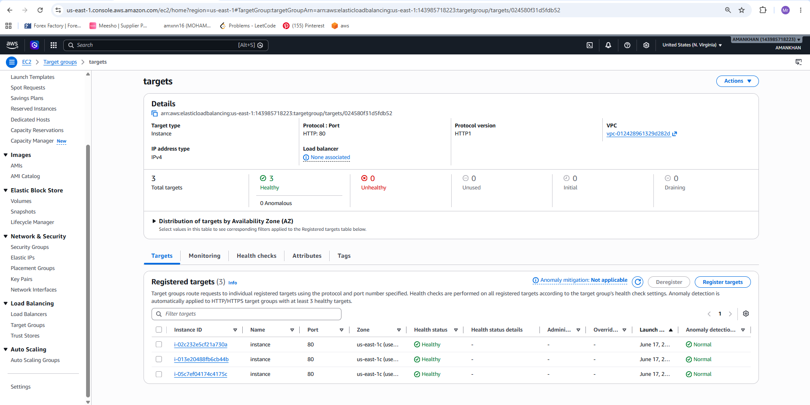
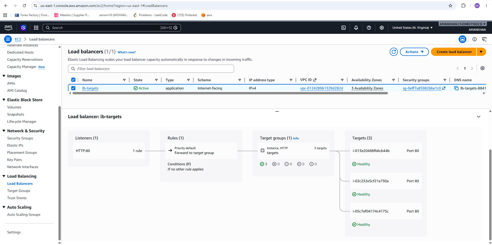
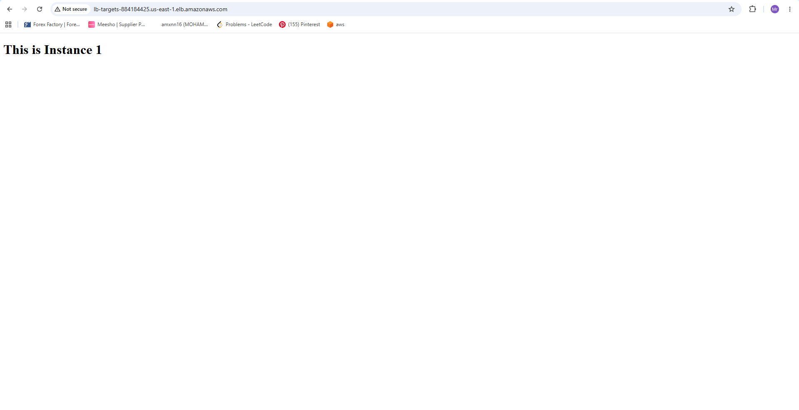
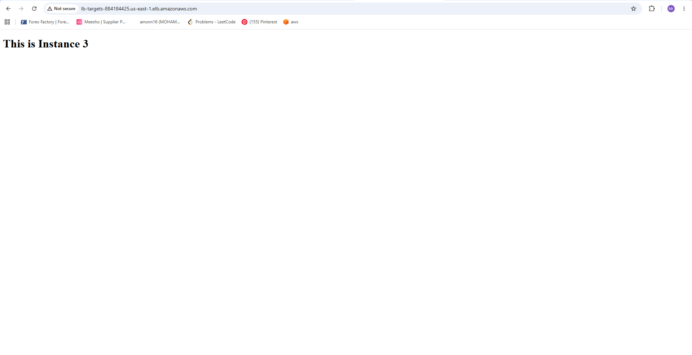

# AWS Application Load Balancer with Multiple EC2 Instances

## Author
**MOHAMMED AMANKHAN**

---

## Project Overview

This project demonstrates how to configure an AWS Application Load Balancer (ALB) to distribute incoming HTTP traffic across three EC2 instances.

The load balancer automatically routes requests to healthy instances, improving availability, scalability, and fault tolerance.

---

## Architecture

Client Request
↓
Application Load Balancer (HTTP:80)
↓
Target Group
↓
EC2 Instance 1
EC2 Instance 2
EC2 Instance 3

---

## Technologies Used

- AWS EC2
- AWS Application Load Balancer (ALB)
- Target Groups
- Security Groups
- Amazon Linux
- Apache HTTP Server (httpd)

---

# Step-by-Step Implementation

## Step 1: Launch Three EC2 Instances

Launch 3 EC2 instances in the same VPC.

### Instance Details

| Instance | Purpose |
|-----------|----------|
| Instance 1 | Web Server 1 |
| Instance 2 | Web Server 2 |
| Instance 3 | Web Server 3 |

### Security Group Rules

| Type | Port |
|--------|--------|
| HTTP | 80 |
| HTTPS | 443 |
| SSH | 22 |

---

## Step 2: Install Apache Web Server

Connect to each instance using SSH.

### Update Packages

```bash
sudo yum update -y
```

### Install Apache

```bash
sudo yum install httpd -y
```

### Start Apache

```bash
sudo systemctl start httpd
sudo systemctl enable httpd
```

---

## Step 3: Create Custom Web Pages

### Instance 1

```bash
echo "<h1>This is Instance 1</h1>" | sudo tee /var/www/html/index.html
```

### Instance 2

```bash
echo "<h1>This is Instance 2</h1>" | sudo tee /var/www/html/index.html
```

### Instance 3

```bash
echo "<h1>This is Instance 3</h1>" | sudo tee /var/www/html/index.html
```

---

## Step 4: Verify Individual Instances

Open the public IP of each instance in a browser.

Expected Output:

### Instance 1

```
This is Instance 1
```

### Instance 2

```
This is Instance 2
```

### Instance 3

```
This is Instance 3
```

---

## Step 5: Create a Target Group

Navigate to:

```
EC2 → Target Groups
```

### Configuration

- Target Type: Instance
- Protocol: HTTP
- Port: 80
- VPC: Select your VPC

Click:

```
Create Target Group
```

---

## Step 6: Register EC2 Instances

Register all three EC2 instances into the Target Group.

### Registered Targets

- Instance 1
- Instance 2
- Instance 3

Verify all targets become:

```
Healthy
```

---

## Step 7: Create Application Load Balancer

Navigate to:

```
EC2 → Load Balancers
```

Click:

```
Create Load Balancer
```

Select:

```
Application Load Balancer
```

### Configuration

- Scheme: Internet-facing
- IP Address Type: IPv4
- Listener: HTTP (Port 80)
- Availability Zones: Select all available zones

---

## Step 8: Attach Target Group

During Load Balancer creation:

Select the previously created Target Group.

Routing Configuration:

```
Forward Requests To Target Group
```

Finish creating the Load Balancer.

---

## Step 9: Configure Security Group

Allow the following inbound rules:

| Type | Port |
|--------|--------|
| HTTP | 80 |
| HTTPS | 443 |
| SSH | 22 |

Source:

```
0.0.0.0/0
```

---

## Step 10: Verify Health Checks

Navigate to:

```
Target Groups → Targets
```

Verify:

```
Healthy: 3
Unhealthy: 0
```

---

## Step 11: Access Load Balancer DNS

Copy the DNS name of the Load Balancer.

Example:

```text
http://lb-targets-xxxxxxxx.us-east-1.elb.amazonaws.com
```

Open it in the browser.

Refresh multiple times.

Expected Output:

```text
This is Instance 1
```

Refresh again:

```text
This is Instance 2
```

Refresh again:

```text
This is Instance 3
```

This confirms traffic is being distributed successfully across all instances.

---

# Screenshots Order

## Screenshot 1
Launch and verify all EC2 instances are running.

## Screenshot 2
Configure Security Group with HTTP, HTTPS, and SSH rules.

## Screenshot 3
Create Target Group.

## Screenshot 4
Create Application Load Balancer and attach Target Group.

## Screenshot 5
Access Load Balancer DNS and verify traffic distribution:
- Instance 1 Page
- Instance 2 Page
- Instance 3 Page

---

# Result

Successfully implemented an AWS Application Load Balancer that distributes incoming HTTP traffic among three healthy EC2 instances using a Target Group.

Benefits achieved:

- High Availability
- Load Distribution
- Scalability
- Fault Tolerance
- Improved Reliability

---
# Screenshots

## Step 1: EC2 Instances Running



---

## Step 2: Security Group Configuration



---

## Step 3: Target Group Creation



---

## Step 4: Application Load Balancer



---

## Step 5: Load Balancer Output - Instance 1



---

## Step 6: Load Balancer Output - Instance 2


---

## Step 7: Load Balancer Output - Instance 3



# License

MIT License

Copyright (c) 2026 MOHAMMED AMANKHAN

Permission is hereby granted, free of charge, to any person obtaining a copy
of this software and associated documentation files (the "Software"), to deal
in the Software without restriction, including without limitation the rights
to use, copy, modify, merge, publish, distribute, sublicense, and/or sell
copies of the Software.

THE SOFTWARE IS PROVIDED "AS IS", WITHOUT WARRANTY OF ANY KIND.

---

# Created By

**MOHAMMED AMANKHAN**
